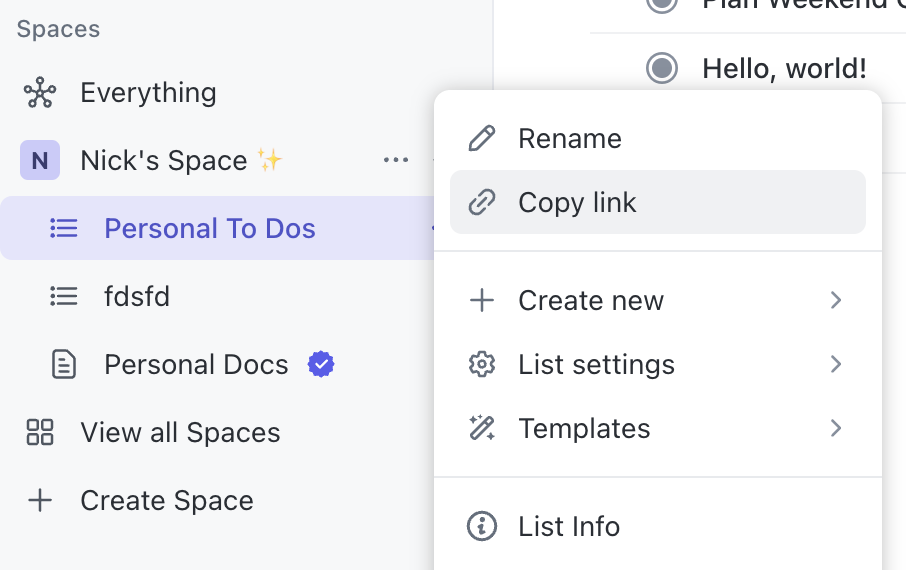

# ClickUp PopClip Extension

Create a task in [ClickUp](https://clickup.com/).

The task will be created in the list you specify, with the title and description set from the selected text. If clipped from a supported browser, the source page URL will be added to the task description.

## Configuration

- **List URL**: This identifies the list that you want PopClip to add tasks to. It can be found in ClickUp in the sidebar menu under "Copy Link". It looks something like this: `https://app.clickup.com/9015733031/v/li/901505519289`

## Notes

Author: Nick Moore. Icon by Simple Icons (CC0).

Links:

- [ClickUp API 2.0 Docs](https://clickup.com/api/)

## Changelog

- 10 Jun 2024: Initial release
