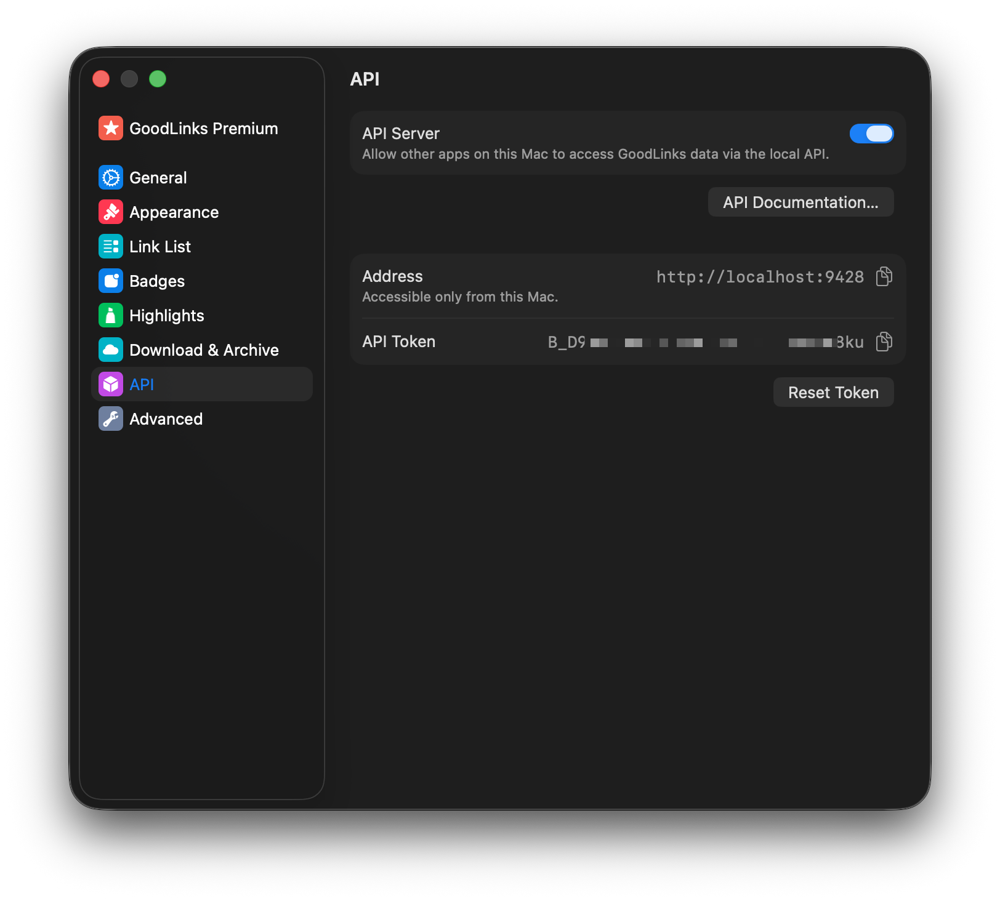

# GoodLinks

Save a selected URL directly to the local [GoodLinks](https://goodlinks.app/)
app via its built-in API.

## Configuration

Before using the extension:

1. Open GoodLinks and go to `Settings > API`.
2. Enable `API Server`.
3. Copy the API Token into the PopClip extension settings.

Optional settings:

- `Default Tags`: Comma-separated tags to add to each saved link.
- `Star by Default`: Save each new link to the Starred list.
- `Mark as Read`: Save each new link as already read.

## Notes

- Requires GoodLinks 3.2 or later.
- The extension uses GoodLinks' local `POST /api/v1/links` endpoint, which adds
  the URL if it is new or updates the existing saved link if the URL is already
  in your library.

Links:

- [GoodLinks API documentation](https://goodlinks.app/api/)

## Changelog

- 3 Apr 2026: Initial version
