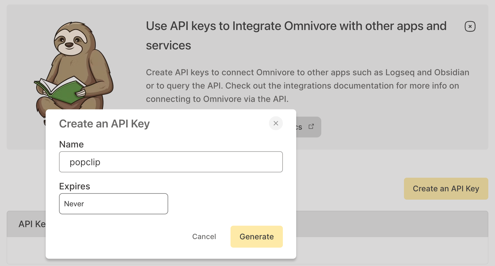

# Omnivore PopClip Extension

Send a URL to the read-it-later service [Omnivore](https://omnivore.app/).

## Configuration

Generate an Omnivore API key as follows:

1. Sign in to your Omnivore account.
2. Visit your [API Key settings page](https://app.omnivore.app/settings/api).
3. Click "Create an API Key".
4. Enter a name for the API Key (for example "popclip") and click "Generate".
5. Copy the key and paste it into the extension's settings.

## About

Author: Nick Moore

Links:

- [Omnivore API docs](https://docs.omnivore.app/integrations/api.html)

## Changelog

- 7 Jun 2024: Initial release
