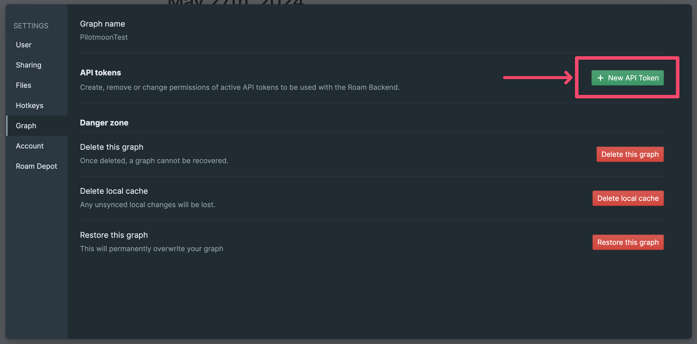
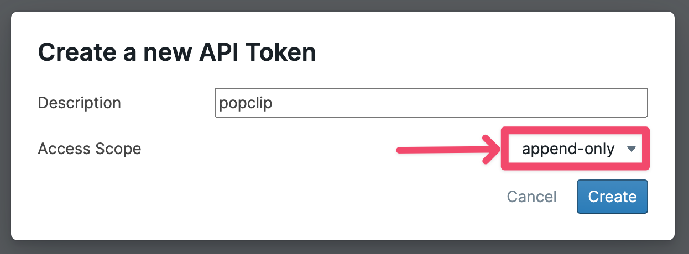

# Roam Research

Capture text to a [Roam Research][home] hosted graph.

The extension sends the text directly to the Roam Research API and does not need the macOS app to be installed locally

When capturing from a supported browser the source link will be added.

## Configuration

You'll need to provide the following:

- **API Token**: See below.
- **Graph Name**: The name of an existing hosted graph to capture to.
- **Page Name** (optional): Name of the page to capture to. If the page doesn't exist, it will be created. If you leave it blank, the text will be added to the daily note page.
- **Nest Under** (optional): If provided, the notes will be nested under this block. If the block doesn't exist, it will be created. If omitted, the notes will be added to the page directly.

### API Token

To use this extension, you need to get an API token from your Roam Research settings.

1. Go to the settings for the hosted graph you want to capture text to.
2. Click the Graph tab on the left.
3. Click the New API Token button.
   
4. Give the token a name (for example "popclip") and select "append-only" as the Access Scope. Click the Create button. 
5. Copy the token and paste it into the API Token field in the extension's settings.

## Notes

Author: Nick Moore. Icon by Simple Icons (CC0).

The extension uses the [Roam Append API (Beta)][api].

[home]: https://roamresearch.com/
[api]: https://roamresearch.com/#/app/developer-documentation/page/eb8OVhaFC

## Changelog

- 27 May 2024: Initial release.
